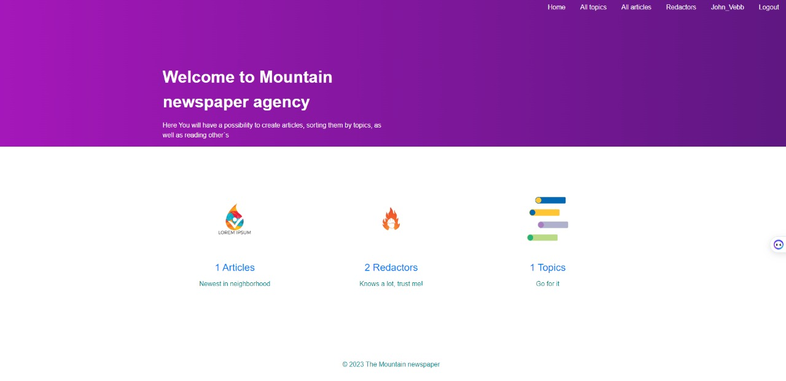

# Newspaper project

Django project for managing workflow in a newspaper agency

## Check it out!
[Newspaper project deployed to Render](https://newspaper-agence.onrender.com/)

## Installation

```shell
git clone https://github.com/skmiwa1/newspaper-agency.git
cd Newspaper_project
python -m venv venv
venv\Scripts\activate (on Windows)
source venv/bin/activate (on macOS)
pip install -r requirements.txt
python manage.py migrate
python manage.py runserver #Starts Django Server
```

## Features

* Authentication functionality for Worker/User
* Create articles, as well as managing them after directly from our website
* Search by name [topics, Redactors and Articles.
* Powerful admin panel for advanced managing!

## Credential for testing
  - Login: `John_Vebb`
  - Password: `1qazcde3`

## Demo
* Main page


* Article list


* Article delete page

